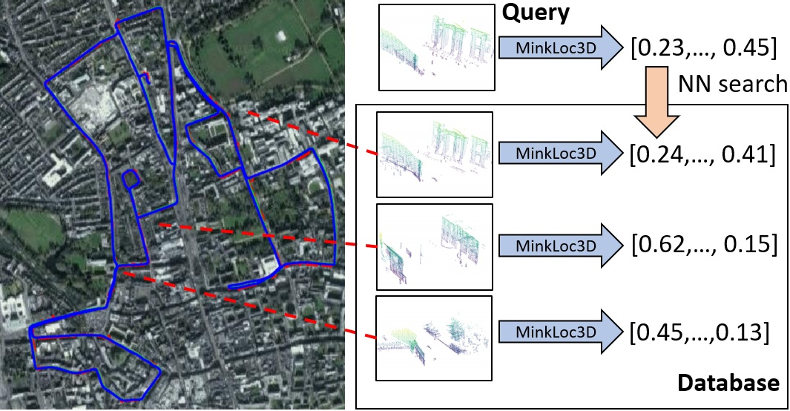

# MinkLoc3D: Point Cloud Based Large-Scale Place Recognition

[MinkLoc3D: Point Cloud Based Large-Scale Place Recognition](http://arxiv.org/abs/2011.04530) WACV 2021

[Jacek Komorowski](mailto:jacek.komorowski@pw.edu.pl)

Warsaw University of Technology



### Introduction
The paper presents a learning-based method for computing a discriminative 3D point cloud descriptor for place recognition purposes. 
Existing methods, such as PointNetVLAD, are based on unordered point cloud representation. They use PointNet as the first processing step to extract local features, which are later aggregated into a global descriptor. 
The PointNet architecture is not well suited to capture local geometric structures. Thus, state-of-the-art methods enhance vanilla PointNet architecture by adding different mechanism to capture local contextual information, such as graph convolutional networks or using hand-crafted features. 
We present an alternative approach, dubbed **MinkLoc3D**, to compute a discriminative 3D point cloud descriptor, based on a sparse voxelized point cloud representation and sparse 3D convolutions.
The proposed method has a simple and efficient architecture. Evaluation on standard benchmarks proves that MinkLoc3D outperforms current state-of-the-art.  

### Citation
If you find this work useful, please consider citing:

    @inproceedings{kom21ml,
    title={MinkLoc3D: Point Cloud Based Large-Scale Place Recognition},
    author={Jacek Komorowski},
    booktitle={The IEEE Winter Conference on Applications of Computer Vision},
    year={2021}
    }

### Environment and Dependencies
Code was tested using Python 3.8 with PyTorch 1.7 and MinkowskiEngine 0.4.3 on Ubuntu 18.04 with CUDA 10.2.

The following Python packages are required:
* PyTorch (version 1.7)
* MinkowskiEngine (version 0.4.3)
* pytorch_metric_learning (version 0.9.94 or above)
* tensorboard
* pandas
* bitarray
* tqdm

### Datasets

**MinkLoc3D** is trained using a subset of Oxford RobotCar and In-house (U.S., R.A., B.D.) datasets introduced in
*PointNetVLAD: Deep Point Cloud Based Retrieval for Large-Scale Place Recognition* paper ([link](https://arxiv.org/pdf/1804.03492)).
For dataset description see PointNetVLAD paper or github repository ([link](https://github.com/mikacuy/pointnetvlad)).

You can download training and evaluation datasets from 
[here](https://drive.google.com/open?id=1rflmyfZ1v9cGGH0RL4qXRrKhg-8A-U9q) 
([alternative link](https://drive.google.com/file/d/1-1HA9Etw2PpZ8zHd3cjrfiZa8xzbp41J/view?usp=sharing)). 
Extract the folder in the same directory as the project code. Thus, in that directory you must have two folders: 1) benchmark_datasets and 2) MinkLoc3D

Before the network training or evaluation, run the below code to generate pickles with positive and negative point clouds for each anchor point cloud. 
 
```generate pickles
cd generating_queries/ 

# Generate training tuples for the Baseline Dataset
python generate_training_tuples_baseline.py

# Generate training tuples for the Refined Dataset
python generate_training_tuples_refine.py

# Generate evaluation tuples
python generate_test_sets.py
```

### Training
To train **MinkLoc3D** network, download and decompress the dataset and generate training pickles as described above.
Edit the configuration file (`config_baseline.txt` or `config_refined.txt`). 
Set `dataset_folder` parameter to the dataset root folder.
Modify `batch_size_limit` parameter depending on available GPU memory. 
Default limit (=256) requires at least 11GB of GPU RAM.

To train the network, run:

```train baseline
cd training

# To train minkloc3d model on the Baseline Dataset
python train_detector.py --config ../config_baseline.txt --model_config ../models/minkloc3d.txt

# To train minkloc3d model on the Refined Dataset
python train_detector.py --config ../config_refined.txt --model_config ../models/minkloc3d.txt
```

### Pre-trained Models

Pretrained models are available in `weights` directory
- `minkloc3d_baseline.pth` trained on the Baseline Dataset (training subset of Oxford RobotCar). 
- `minkloc3d_refined.pth` trained on the Refined Dataset (training subset of Oxford RobotCar and In-house Dataset). 

### Evaluation

To evaluate pretrained models run the following commands:

```eval baseline
cd eval

# To evaluate the model trained on the Baseline Dataset
python evaluate.py --config ../config_baseline.txt --model_config ../models/minkloc3d.txt --weights ../weights/minkloc3d_baseline.pth

# To evaluate the model trained on the Refined Dataset
python evaluate.py --config ../config_refined.txt --model_config ../models/minkloc3d.txt --weights ../weights/minkloc3d_refined.pth
```

## Results

**MinkLoc3D** performance (measured by Average Precision@1\%) compared to state-of-the-art:

### Trained on Baseline Dataset

| Method         | Oxford  | U.S. | R.A. | B.D |
| ------------------ |---------------- | -------------- |---|---|
| PointNetVLAD  |     80.3     |   72.6 | 60.3 | 65.3 |
| PCAN  |     83.8     |   79.1 | 71.2 | 66.8 |
| DAGC  |     87.5     |   83.5 | 75.7 | 71.2 |
| LPD-Net  |     94.9   |   **96.0** | 90.5 | **89.1** |
| **MinkLoc3D (our)**  |     **97.9**     |   95.0 | **91.2** | 88.5 |


### Trained on Refined Dataset

| Method         | Oxford  | U.S. | R.A. | B.D |
| ------------------ |---------------- | -------------- |---|---|
| PointNetVLAD  |     80.1     |   94.5 | 93.1 | 86.5 |
| PCAN  |     86.4     |   94.1 | 92.3 | 87.0 |
| DAGC  |     87.8     |   94.3 | 93.4 | 88.5 |
| LPD-Net  |     94.9     |   98.9 | 96.4 | 94.4 |
| **MinkLoc3D (our)**  |     **98.5**     |   **99.7** | **99.3** | **96.7** |

### License
Our code is released under the MIT License (see LICENSE file for details).
